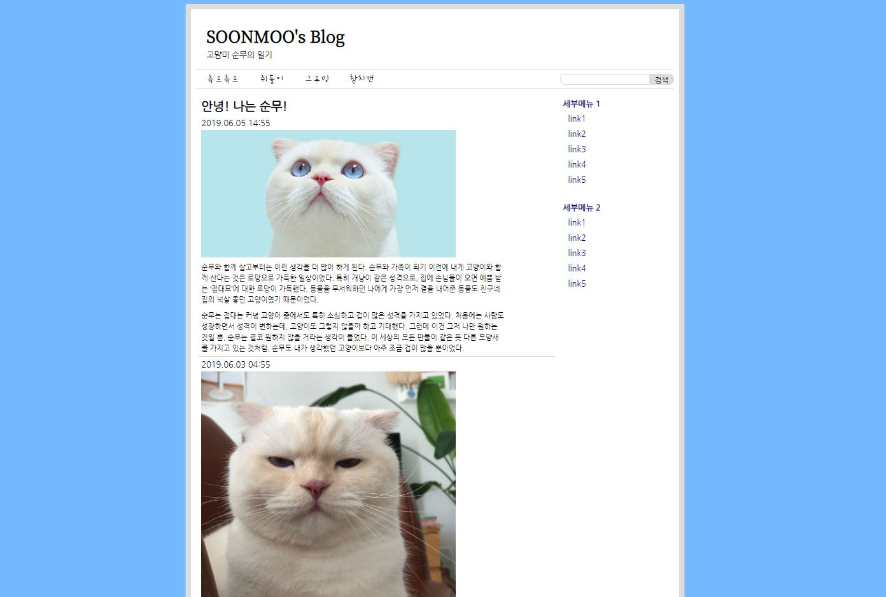

# Mini projects by using HTML and CSS
------------------------------------------
### 1. button

- link: https://idaeun.github.io/HTML-CSS3/button/button.html
- code: https://github.com/iDaeun/HTML-CSS3/blob/master/button/button.html
------------------------------------------
## 2. instagram

- link: https://idaeun.github.io/HTML-CSS3/instagram_proj/instagram.html
- code: https://github.com/iDaeun/HTML-CSS3/tree/master/instagram_proj
------------------------------------------
## 3. blog

- link: https://idaeun.github.io/HTML-CSS3/blog/blog_page.html
- code: https://github.com/iDaeun/HTML-CSS3/tree/gh-pages/blog
